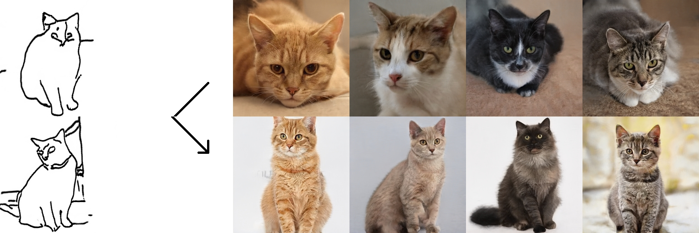
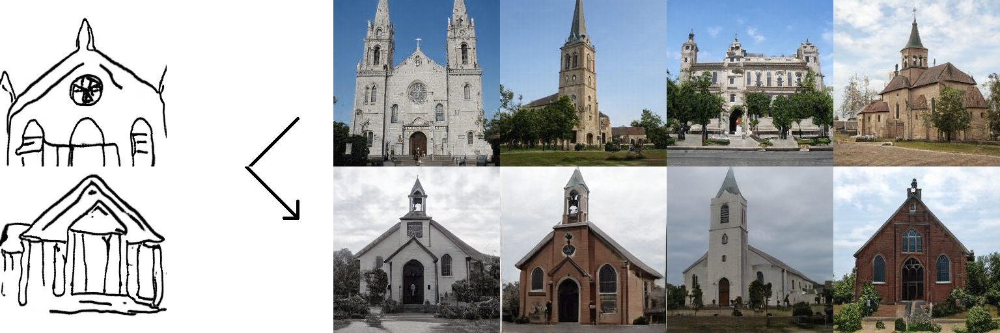
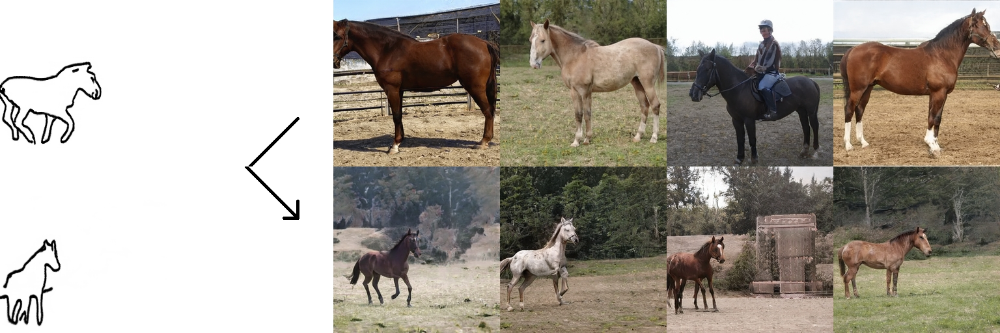
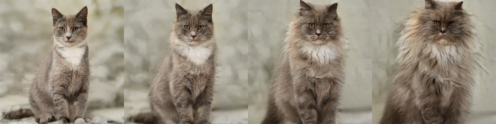

# Sketch Your Own GAN -- Jittor

## Introduction

Our project reconstructs the original ariticle *Sketch Your Own GAN* (by PyTorch) with deep learning framework Jittor.

### Paper

The original paper introduced a new method, which takes in one or a few hand-drawn sketches and customizes an off-the-shelf GAN to match the input sketch. While our new model changes an object’s shape and pose, other visual cues such as color, texture, background, are faithfully preserved after the modification.

[**Paper**](https://arxiv.org/abs/2108.02774) | [**Code**](https://github.com/PeterWang512/GANSketching)

### Jittor

Jittor is a JIT deep learning framework by CG Lab from Tsinghua University. Jittor is based on meta operators and unified compute graph and it could be utilized on both CPU and GPU.

 [**Jittor**](https://cg.cs.tsinghua.edu.cn/) | [**Code**](https://github.com/Jittor/jittor)

## Results

### FID Score

We achieved similar FID score in three different training sets, including **Standing Cat**, **Gabled Church** and **Horse on a side**. The following table shows the original FID score and ours.

|  | Standing cat | Gabled church | Horse on a side |
|---|---|---|---|
| Baseline(Bui et al.) | 59.86 | 29.94 | 43.53 |
| PyTorch(Wang) | 36.73 | 21.35 | 30.39 |
| **Jittor(Ours)** | **38.09** | **20.64** | **30.84** |

**Images produced by our model**





### Latent Space Editing

We also perserve the feature *latent space editing* illustrated in the original article. In the original ariticle, they edit the image with `add fur` operation using [GANSpace](https://github.com/harskish/ganspace), and we successfully reproduced this operation with the model we've trained.



## Getting Started

### Clone our repo

```bash
git clone https://github.com/gansketchjt/gansketchjt.git
cd gansketchjt
```
### Install packages
- Install Jittor (version >= 1.3.1.27 ([Jittor](https://cg.cs.tsinghua.edu.cn/jittor/))
  ```bash
  pip install -r requirements.txt
  ```

### About model weights
Our trained models are in ./weights

If you want to download the models provided by the original repository [**GANSketch**](https://github.com/PeterWang512/GANSketching)
- Run `bash weights/download_weights.sh`

### Generate samples from a customized model

This command runs the customized model specified by `ckpt`, and generates samples to `save_dir`.

```
# generates samples from the "standing cat" model.
python generate.py --ckpt weights/photosketch_standing_cat_aug.pt --save_dir output/samples_standing_cat

# generates samples from the "gabled church" model.
python generate.py --ckpt weights/photosketch_gabled_church_aug.pt --save_dir output/samples_gabled_church

# generates samples from the "horse on a side" model.
python generate.py --ckpt weights/photosketch_horse_on_a_side_aug.pt --save_dir output/samples_horse_on_a_side
```

### Latent space edits by GANSpace

Our model preserves the latent space editability of the original model. Our models can apply the same edits using the latents reported in Härkönen et.al. ([GANSpace](https://github.com/harskish/ganspace)).

```
# add fur to the standing cats
python ganspace.py --obj cat --comp_id 27 --scalar 50 --layers 2,4 --ckpt weights/photosketch_standing_cat_aug.pt --save_dir output/ganspace_fur_standing_cat

# close the eyes of the standing cats
python ganspace.py --obj cat --comp_id 45 --scalar 60 --layers 5,7 --ckpt weights/photosketch_standing_cat_aug.pt --save_dir output/ganspace_eye_standing_cat
```

## Model Training

Training and evaluating on model trained on PhotoSketch inputs requires running [the Precision and Recall metric](https://github.com/kynkaat/improved-precision-and-recall-metric). The following command pulls the submodule of the forked Precision and Recall [repo](https://github.com/PeterWang512/precision_recall).
```bash
git submodule update --init --recursive
```

### Download Datasets and Pre-trained Models

The following scripts downloads our sketch data, our evaluation set, [LSUN](https://dl.yf.io/lsun), and pre-trained models from [StyleGAN2](https://github.com/NVlabs/stylegan2) and [PhotoSketch](https://github.com/mtli/PhotoSketch).
```bash
# Download the sketches
bash data/download_sketch_data.sh

# Download evaluation set
bash data/download_eval_data.sh

# Download pretrained models from StyleGAN2 and PhotoSketch
bash pretrained/download_pretrained_models.sh

# Download LSUN cat, horse, and church dataset
bash data/download_lsun.sh
```

To train FFHQ models with image regularization, please download the [FFHQ dataset](https://github.com/NVlabs/ffhq-dataset) using this [link](https://drive.google.com/file/d/1WvlAIvuochQn_L_f9p3OdFdTiSLlnnhv/view?usp=sharing). This is the zip file of 70,000 images at 1024x1024 resolution. Unzip the files, , rename the `images1024x1024` folder to `ffhq` and place it in `./data/image/`.


### Training Scripts

The example training configurations are specified using the scripts in `scripts` folder. Use the following commands to launch trainings.

```bash
# Train the "horse on a side" model
bash scripts/train_photosketch_horse_on_a_side.sh

# Train the "standing cat" model
bash scripts/train_photosketch_standing_cat.sh

# Train on a "gabled church" model
bash scripts/train_photosketch_gabled_church.sh

```

The training progress is tracked using `wandb` by default. To disable wandb logging, please add the `--no_wandb` tag to the training script.

### Evaluations

Please make sure the evaluation set and model weights are downloaded before running the evaluation.
```bash
# You may have run these scripts already in the previous sections
bash weights/download_weights.sh
bash data/download_eval_data.sh
```

Use the following script to evaluate the models, the results will be saved in a csv file specified by the ``--output`` flag. ``--models_list`` should contain a list of tuple of model weight paths and evaluation data. Please see `weights/eval_list` for example.

```bash
python run_metrics.py --models_list weights/eval_list --output metric_results.csv
```

## Acknowledgments

This repository is largely based on the original repository [**GANSketch**](https://github.com/PeterWang512/GANSketching) implemented in PyTorch.

The development team of Jittor also offers great assist to us.

## About us

